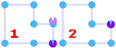

# Arcman - Code Documentation

Here, I will be presenting the core mechanisms of the game.

## How the Player is moving

The first problem that I encountered while developing the game was how the Player will move across the maze;

Firstly, I tried to do solid walls and collision detection between the walls and the Player, but that caused some conception problems:

- The WASD movement needed to be extremelly precise, and it was very sloppy
- There were too many collision checks to make, and the ways to reduce them were very complicated

So, to solve this problem, I chose to change the approach, and build a unoriented graph, in which the Player can move between it's nodes as following:

    

To make the mouvement smooth between two nodes, I implemented a **node overshoot** system, in which the Player moves in the direction of it's target node until it passes the coordinates of the node in the given direction.

 When this happens, we set the Player's position to the position of the target node, and we stop the Player in place.

    

The usage of nodes has bunch of benefits, and unlocks some posibilities for future development:

- There is no need for solid tiles or walls
- Easier to implement the Ghost's movement AI
- Easier to implement a searching algorithm for the Ghosts (like Dijkstra's algorithm or A*)

## How do the Ghosts work

The Ghosts, move between the nodes exactly as the Player does. The only difference is the way the Ghosts choose their next direction of movement

    

For this implementation, the Ghosts will choose a random direction from the list of available directions, and maybe in the future I will implement a custom searching algorithm for each Ghost.

## Collision between Player and Ghosts

Both the Player and the Ghosts have a hitbox that is smaller than their actual size, so that we can leave a little room for error for the Player.

The hitboxes are represented as a circle with a certain radius from the texture's center, and the two Entities collide if the distance between the two circles is lesser than their radius.

    

## How the Pellets are generated

The Pellets are generated using a matrix of characters. If the character at a certain grid position is a '*', we will generate a Small Pellet, if it is a '#', we will generate a Big Pellet, and if it is any other character, we will generate an empty Entity.

    

## Collision between Player and Pellets

The collision between the Player and the Pellets is done in the same way as with the Ghosts.

    

The problem that arises here is that the number of pellets on the map is very big, and if we check each collision every frame, we will do bunch of redundant checks.

To ameliorate that, we will only check if the Player is colliding with Entities that are in it's proximity, like so:

    

By only checking the 4 squared surrounding the Player, we reduce the number of collision checks to just 4.
